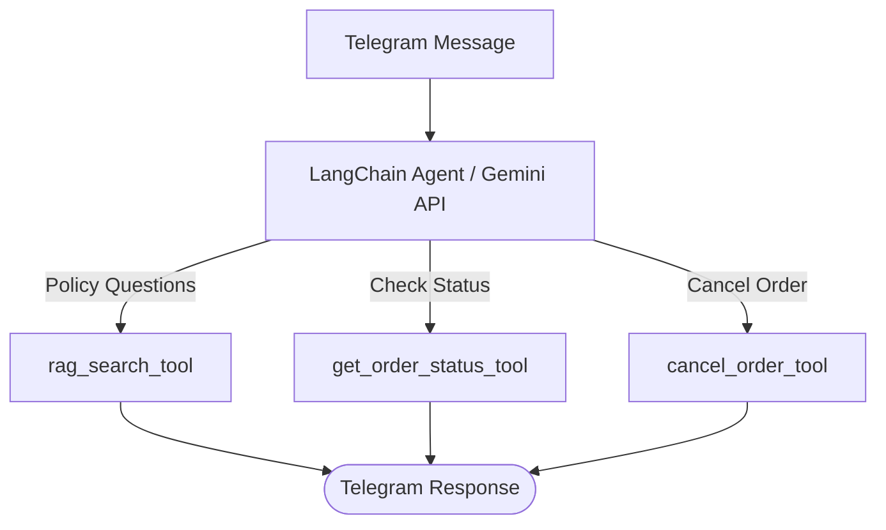

# CommerceCareAI - Telegram Support Agent

A Telegram bot built with LangChain that automates e-commerce customer support. 
It combines a RAG pipeline for answering policy questions with custom tools to check order statuses and process cancellations via a local database.

---

## Tech Stack

- **LLM & Embeddings:** Gemini API
- **Vector DB:** ChromaDB
- **Agent Framework:** LangChain

---
## Data Flow

---

## Quick Start

### 1. Prerequisites

    Ensure:

    Python 3.10+ installed
    Git installed
    Google Gemini API Key
    Telegram Bot Token

### 2. Installation

    git clone https://github.com/yussuferen/ecommerce-support-agent.git
    cd ecommerce-support-agent
    python -m venv venv
    source venv/bin/activate
    pip install -r requirements.txt

### 3. Environment Configuration

    Create a .env file in the root directory of the project. 
    Pass your API keys inside the env:
    GEMINI_API_KEY=your_gemini_api_key_here
    TELEGRAM_TOKEN=your_telegram_bot_token_here

### 4. Running

    python app.py
